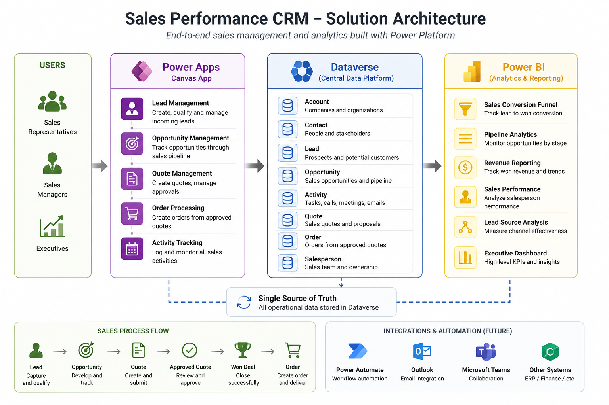
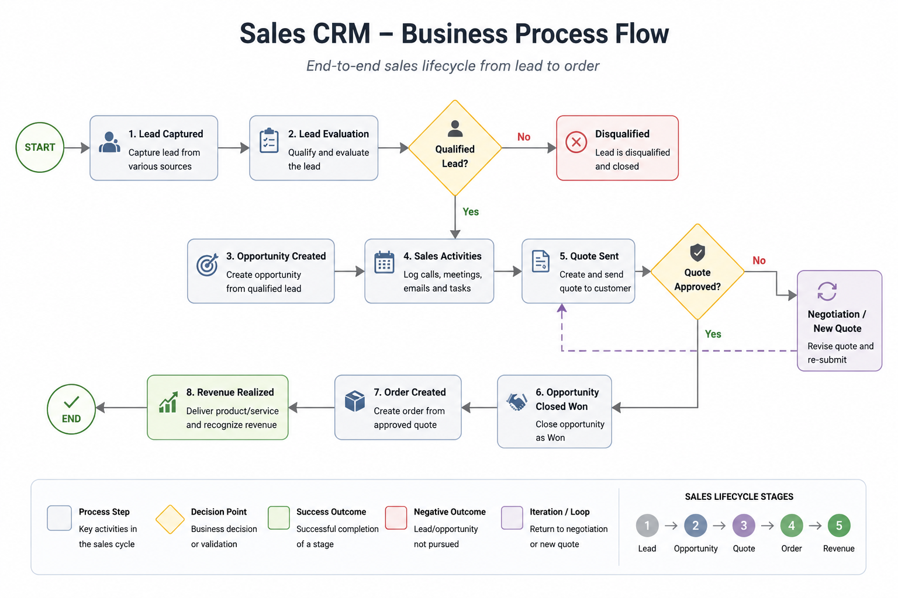
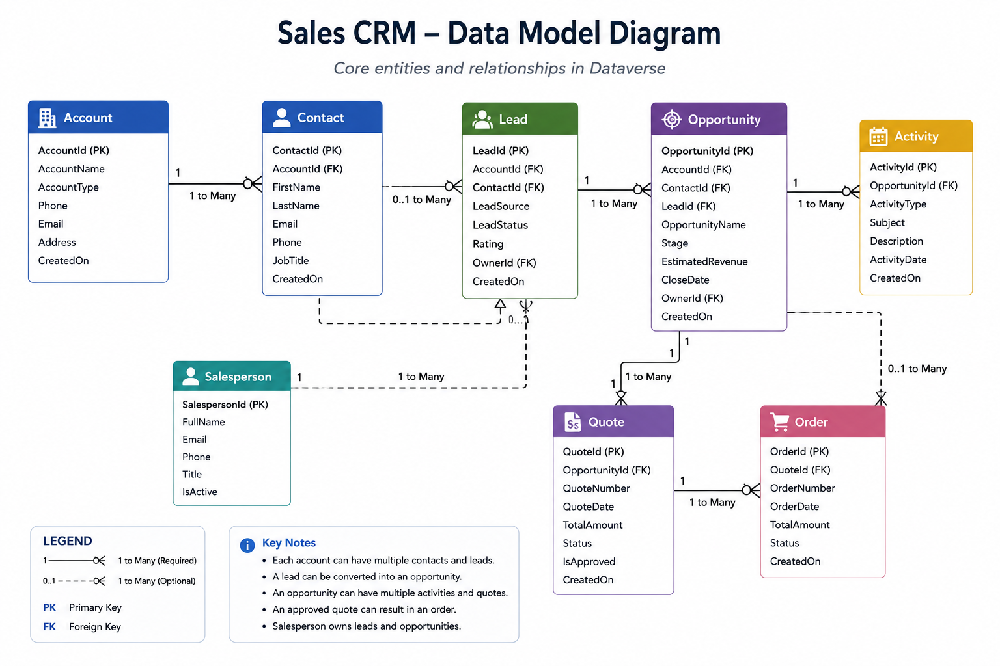
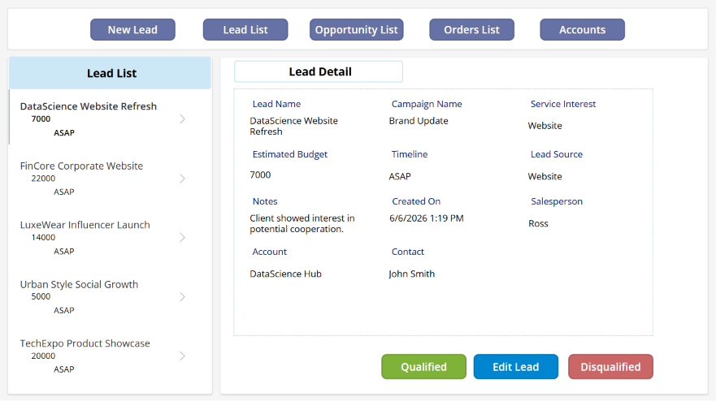
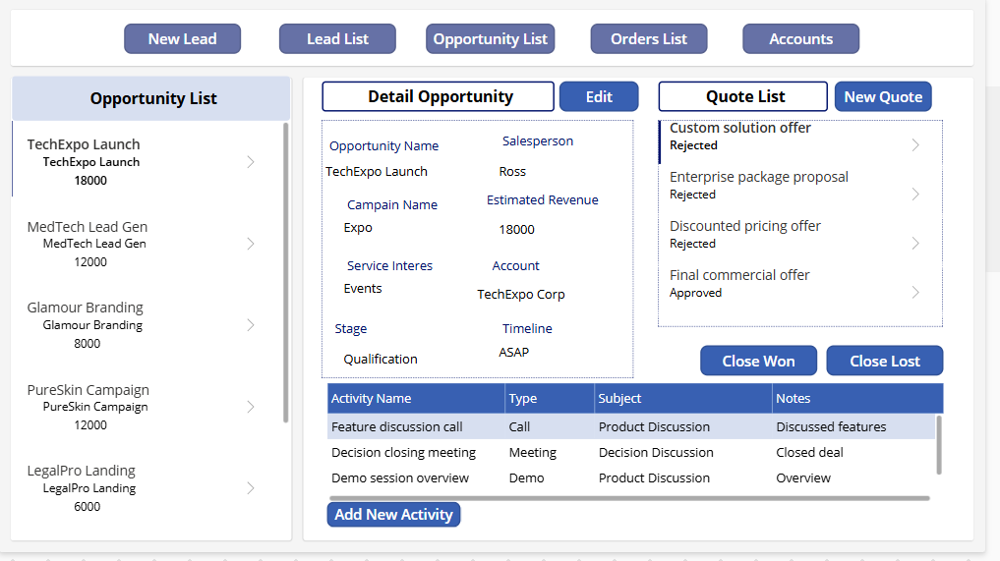
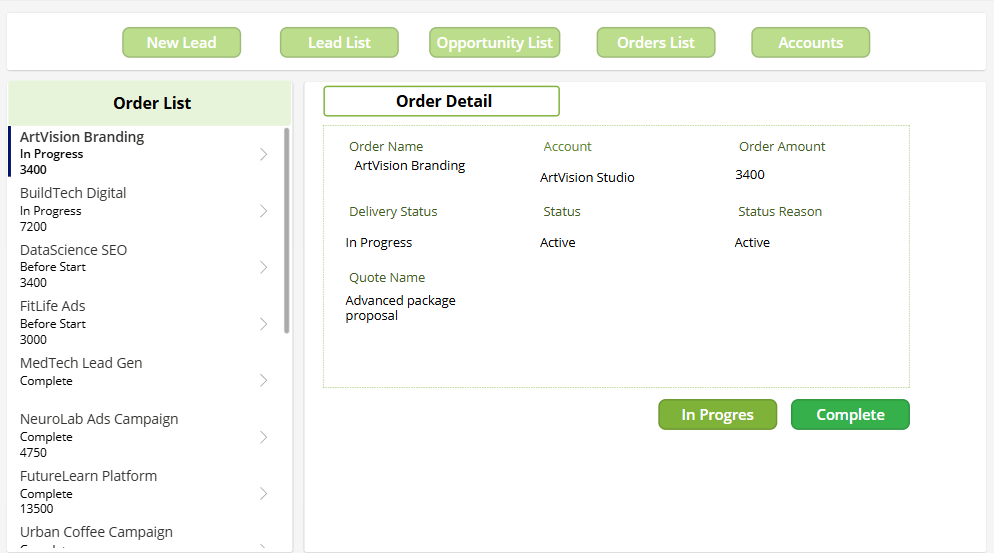
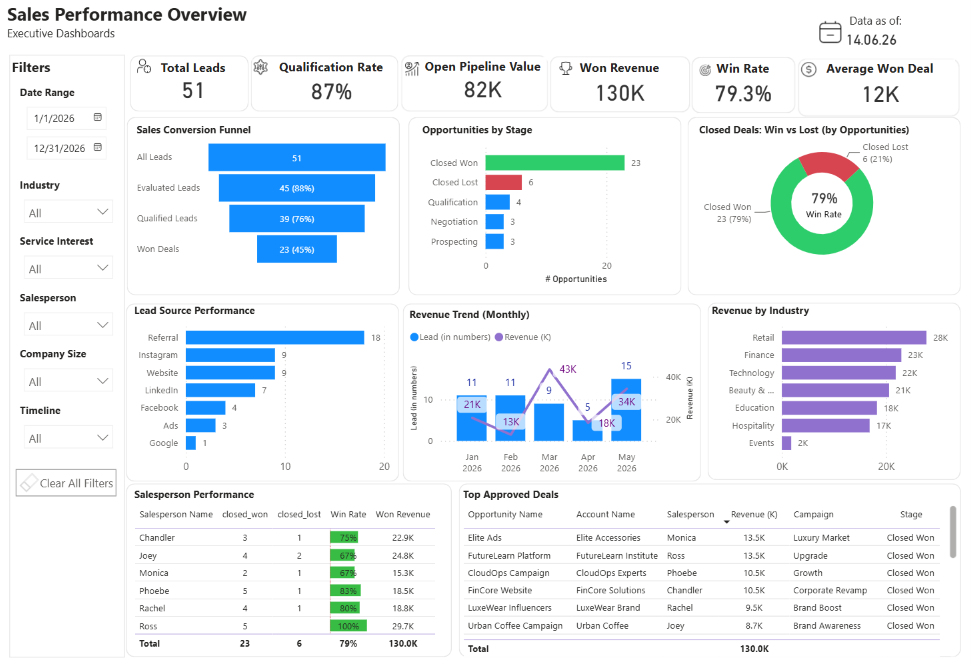

# Sales Performance CRM

End-to-end Sales CRM and analytics solution built with Power Platform.

---

## Overview

This project simulates a complete B2B sales lifecycle management system built using:

- Power Apps (Canvas App)
- Dataverse
- Power BI

The solution covers the entire sales process:

Lead → Qualification → Opportunity → Quote → Order

The project combines operational CRM workflows with analytical reporting to provide full visibility into sales performance and pipeline progression.

---

## Solution Highlights

- full B2B sales lifecycle simulation
- integrated operational CRM and analytics
- relational Dataverse data model
- multi-stage opportunity management
- quote approval and order generation process
- executive Power BI dashboard

---

## Business Problem

Organizations often struggle with:

- tracking lead conversion
- managing sales pipeline visibility
- monitoring opportunity progress
- analyzing sales performance
- connecting operational CRM data with analytics

This solution provides a centralized sales workflow and executive reporting layer.

---

## Solution Architecture

### Operational Layer
- Power Apps Canvas App for sales operations
- Dataverse as the central relational data platform

### Analytics Layer
- Power BI executive dashboard
- pipeline analytics
- conversion tracking
- revenue monitoring
- salesperson performance analysis

---

## Architecture Diagram



---

## Core Features

### Lead Management
- lead creation and qualification
- account and contact assignment
- lead evaluation process
- salesperson ownership

### Opportunity Management
- opportunity lifecycle tracking
- stage progression management
- sales activity monitoring
- revenue and probability tracking

### Quote Management
- multiple quotes per opportunity
- quote approval process
- approved quote validation
- negotiation support

### Order Management
- order creation from approved quote
- operational delivery tracking
- end-to-end sales flow transition

### Power BI Analytics
- sales conversion funnel
- revenue tracking
- salesperson performance analytics
- lead source analysis
- pipeline monitoring
- executive KPI reporting

---

## Business Process

The CRM workflow follows a structured B2B sales lifecycle:

Lead → Evaluation → Qualification → Opportunity → Quote → Negotiation → Won Deal → Order

---

## Business Process Diagram



---

## Data Model

Main entities:

- Account
- Contact
- Lead
- Opportunity
- Activity
- Quote
- Order
- Salesperson

The system uses a relational Dataverse model to support the operational CRM workflow and reporting layer.

---

## Data Model Diagram



---

## Key Business Outcomes

- centralized sales lifecycle management
- improved pipeline visibility
- standardized quote approval process
- executive sales performance reporting
- end-to-end revenue tracking

---

## Power Apps Screenshots

### Lead Management

The Lead module supports initial sales intake, qualification, and account assignment.



---

### Opportunity Management

The Opportunity screen centralizes:
- sales activities
- quote lifecycle
- opportunity progression
- deal closure actions



---

### Order Management

The Order module represents the final operational stage of the sales lifecycle after successful quote approval and opportunity closure.



---
## Power Apps Solution Export

The exported Power Apps solution is available in the `power-apps/` folder.

The solution package includes the Canvas App and Dataverse components used to support the CRM workflow, including tables, relationships, choices and application logic.

> Note: The solution is exported as an unmanaged solution for portfolio and development review purposes. Demo data is not included in the solution package.

## Power BI Dashboard

The Power BI reporting layer provides executive visibility into:
- pipeline health
- lead conversion
- revenue trends
- salesperson performance
- sales funnel effectiveness

### Dashboard Preview



---

## Project Structure

```text
docs/               → project documentation
screenshots/        → application and dashboard screenshots
diagrams/           → architecture and process diagrams
power-apps/         → exported Power Apps solution
power-bi/           → Power BI dashboard files
```

---

## Technologies

- Power Apps Canvas
- Dataverse
- Power BI
- Power Fx
- DAX
- Dataverse Relational Modeling

---

## Future Improvements

- Power Automate approval workflows
- role-based security model
- SLA and activity monitoring
- forecast and revenue projections
- advanced sales KPIs
